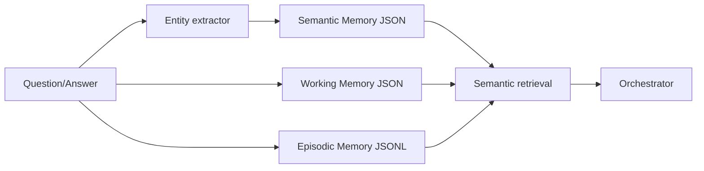

# Multi-level Persistent Memory System



## Layers

1. Working memory stores recent turns with a capacity limit.
2. Episodic memory stores cross-session interaction summaries in JSONL.
3. Semantic memory stores entities and relations extracted from interactions.

Run:

```bash
python demo_memory.py
```
