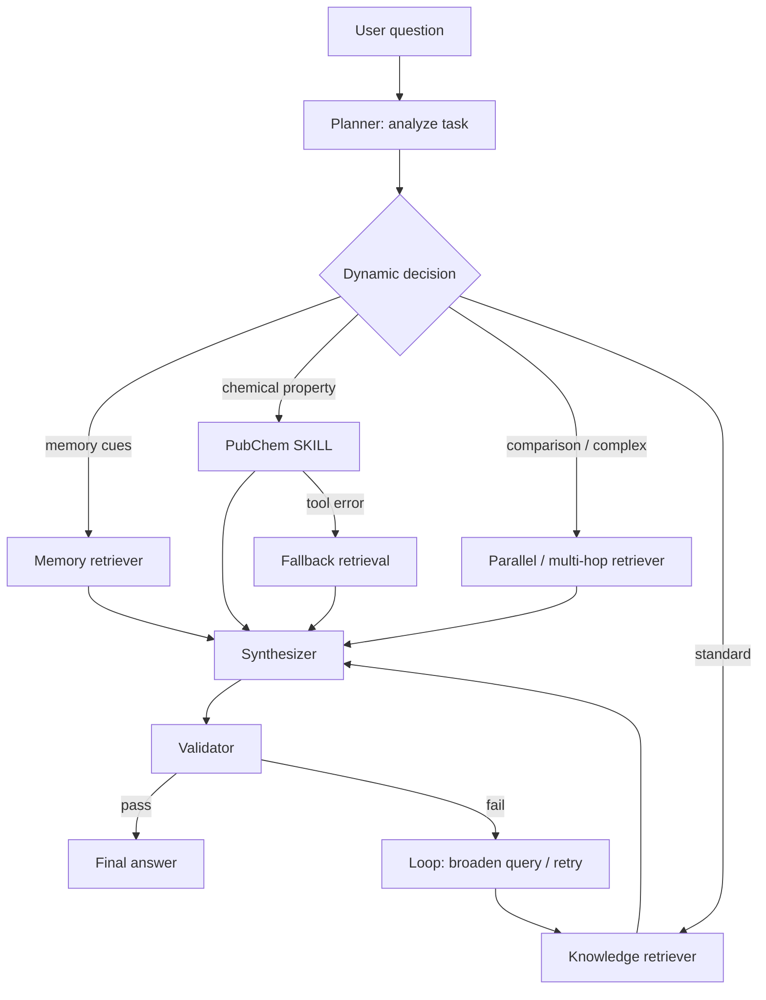

# Advanced Dynamic Orchestration Architecture



## Dynamic vs predefined chain

Predefined baseline:

```text
planner -> knowledge-retriever -> synthesizer -> validator
```

Dynamic chain examples:

```text
planner -> skill-router -> knowledge-retriever -> synthesizer -> validator
planner -> memory-retriever -> parallel-retriever -> synthesizer -> validator
planner -> skill-router -> error-recovery -> fallback-retriever -> synthesizer -> validator
```

The dynamic chain is generated from task features such as chemical-property requests, memory references, comparison terms, and complexity indicators.
