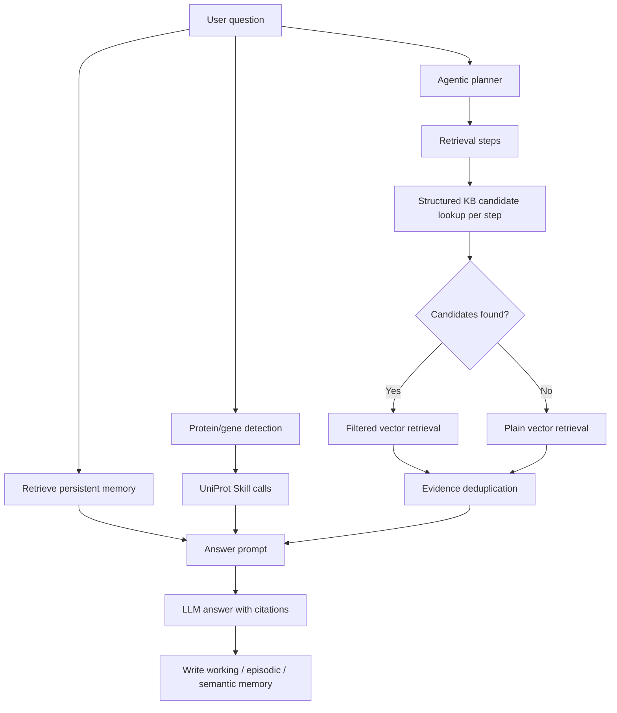

# Agentic Hybrid RAG

This module integrates the previously separate optional capabilities into one collaborative question-answering path.

## Purpose

The standalone buttons are kept as ablation baselines:

- Basic RAG: vector retrieval only.
- Agentic RAG: LLM-planned multi-step vector retrieval.
- Hybrid RAG: structured KB filtering plus vector retrieval.
- Memory system: persistent working, episodic, and semantic memory.
- UniProtProteinSkill: live external protein/gene lookup.

`Agentic Hybrid RAG` combines them:



## Execution Strategy

For each planner step:

1. Try `structured_candidates(step.query)`.
2. If structured candidates exist, use `filtered_vector_search` only inside those candidate knowledge sets.
3. If no structured candidates exist, fall back to normal vector retrieval.
4. Detect obvious protein/gene mentions and call `UniProtProteinSkill` when useful.
5. Deduplicate evidence across all steps.
6. Build the final prompt with memory context, planner trace, structured candidates, UniProt results, and evidence chunks.
7. Record the final interaction into the persistent memory system with mode `agentic_hybrid_rag`.

## Run

```powershell
python scripts/agentic_hybrid_rag.py
```

The web app exposes this through `协作问答`.

## Why It Matters

This integrated mode shows that the optional modules are not isolated demos. Agentic planning decides what to retrieve, the structured KB improves precision for metadata-heavy questions, vector search supplies paragraph-level evidence, UniProt adds standardized live protein annotations, and memory preserves useful interaction history across sessions.
