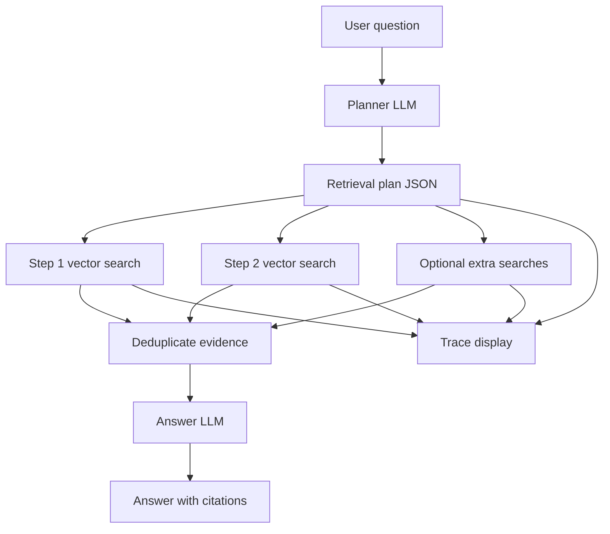

# Agentic RAG

This module upgrades the basic RAG flow by adding an LLM planner before retrieval.

## Flow



## What The Planner Does

The planner receives only the user question and returns a strict JSON object:

```json
{
  "need_retrieval": true,
  "question_type": "comparison",
  "reasoning": "The question compares two methods, so each method needs separate evidence.",
  "steps": [
    {
      "step": 1,
      "query": "Nicheformer main contribution single-cell spatial omics",
      "purpose": "Retrieve evidence about Nicheformer.",
      "top_k": 4
    }
  ]
}
```

The Python code executes each step, records the retrieved sources, removes duplicate chunks, and then sends the final evidence to the answer model.

If the external LLM API is temporarily unavailable, the module keeps the retrieval trace and evidence output instead of crashing. A successful LLM plan is cached under `storage/runtime/agentic_plan_cache.json` and can be reused when the planner API is unstable.

## Run

Open this file in PyCharm and run it directly:

```powershell
python scripts/agentic_rag.py
```

Edit `QUESTION` in `scripts/agentic_rag.py` for one-shot tests, or set `INTERACTIVE = True`.

The web app also exposes:

```text
POST /api/agentic_ask
```

The response includes:

- `plan`: planner JSON
- `trace`: retrieval decision and result trace
- `answer`: final Chinese answer
- `sources`: deduplicated evidence chunks
