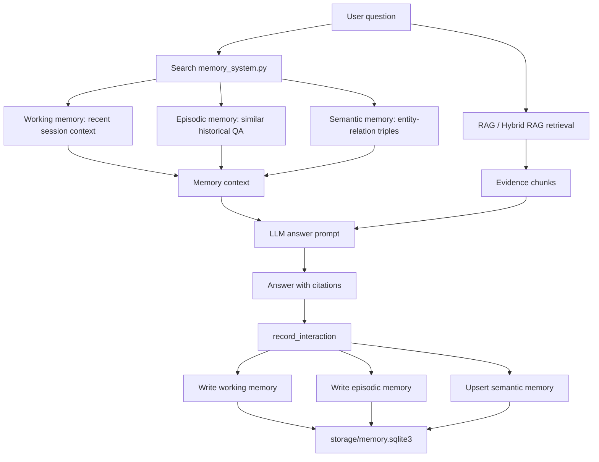
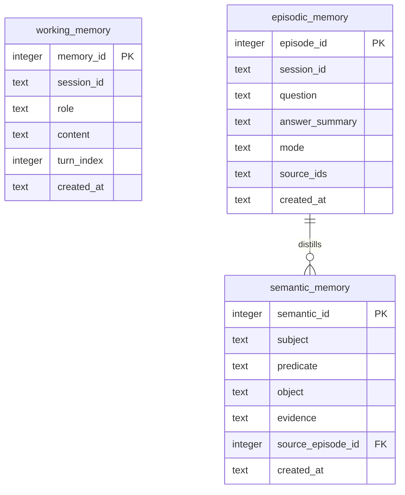

# Multi-Level Persistent Memory System

This Lv.1 optional module adds a persistent three-layer memory system to the single-cell/spatial omics RAG agent.

## Memory Layers

- Working memory: recent messages in the current session, with a capacity limit.
- Episodic memory: cross-session question-answer experiences with answer summaries, source IDs, and RAG mode.
- Semantic memory: structured triples distilled from interactions, such as method-topic or paper-identifier relations.

## Architecture



## Storage Structure



The database file is:

```text
storage/memory.sqlite3
```

## Run

Initialize the database:

```powershell
python scripts/memory_system.py
```

Run a standalone memory write/search demo:

```powershell
python scripts/memory_demo.py
```

Run normal RAG. The RAG path now retrieves memory before generation and records memory after answering:

```powershell
python scripts/rag_chat.py
```

The web app exposes memory in `/health`, and provides:

- `POST /api/memory_search`
- `POST /api/memory_stats`

## Retrieval Strategy

Working memory uses recency retrieval. Episodic and semantic memory use deterministic keyword matching over question text, answer summaries, source IDs, subjects, predicates, objects, and evidence. This keeps the Lv.1 module explainable and independent from extra embedding rebuilds.

## Write Strategy

Each RAG interaction writes:

- the user question and assistant answer summary into working memory;
- a cross-session episode summary into episodic memory;
- deterministic semantic triples into semantic memory.

The semantic triples are intentionally conservative. They capture source identifiers, DOI relations, known method entities, and important topics such as `foundation-model`, `spatial-omics`, `epigenetics`, and `mitochondria`.
