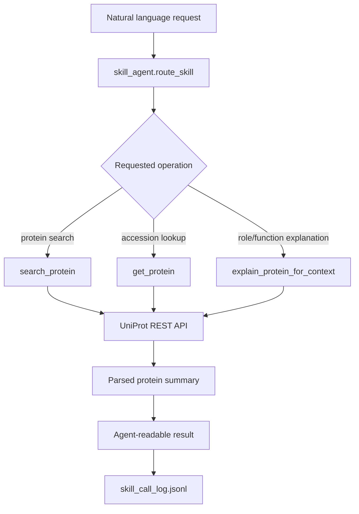

# UniProt Protein Skill

This Lv.1 skill module integrates an external public biological database into the course agent platform.

## Skill

```text
UniProtProteinSkill
```

It queries the public UniProt REST API. No API key is required.

Official API:

```text
https://rest.uniprot.org
```

## Tools

The skill exposes three callable tools.

| Tool | Purpose |
|---|---|
| `search_protein` | Search reviewed human UniProtKB entries by gene/protein name or accession. |
| `get_protein` | Fetch one UniProtKB entry by accession. |
| `explain_protein_for_context` | Search a protein and return a compact explanation tailored to a biological question. |

## Files

```text
scripts/skills/
|-- skill_manifest.json
|-- skill_agent.py
`-- uniprot_protein_skill.py
```

The call log is written to:

```text
storage/runtime/skill_call_log.jsonl
```

## Architecture



## Run

Run the natural language skill demo:

```powershell
python scripts/skills/skill_agent.py
```

Run the lower-level API wrapper demo:

```powershell
python scripts/skills/uniprot_protein_skill.py
```

## Example

Input:

```text
OCT4 在细胞重编程中是什么角色？请查 UniProt。
```

Routing result:

```text
selected_skill: UniProtProteinSkill
selected_tool: explain_protein_for_context
reason: The request asks for a biological role or function.
```

Expected output fields:

```text
accession
protein_name
genes
organism
function
subcellular_location
keywords
uniprot_url
```

Verified examples:

```text
OCT4 -> Q01860, POU domain, class 5, transcription factor 1
TP53 -> P04637, Cellular tumor antigen p53
```

## Why This Skill Adds Capability

The project RAG system answers from local course knowledge assets. UniProtProteinSkill adds live external protein/gene lookup. This is useful when a question mentions biological entities such as `OCT4`, `SOX2`, `KLF4`, `MYC`, `TP53`, `RNF20`, or `NANOG`, especially when the local knowledge base contains only contextual mentions and not standardized protein annotations.

## Notes

- UniProt is public and does not require an API key.
- The implementation uses conservative request sizes to avoid unnecessary load.
- Results are parsed into a compact JSON structure so they can be consumed by an agent or combined with RAG evidence later.
