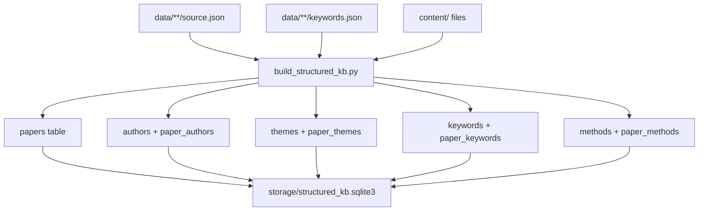
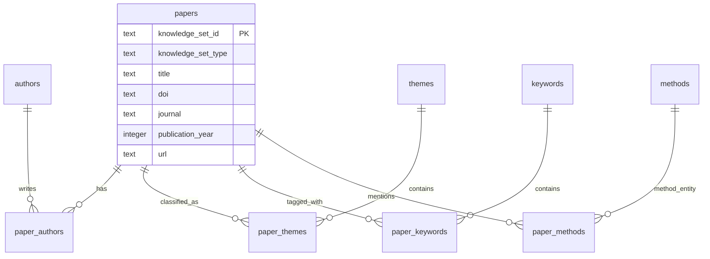
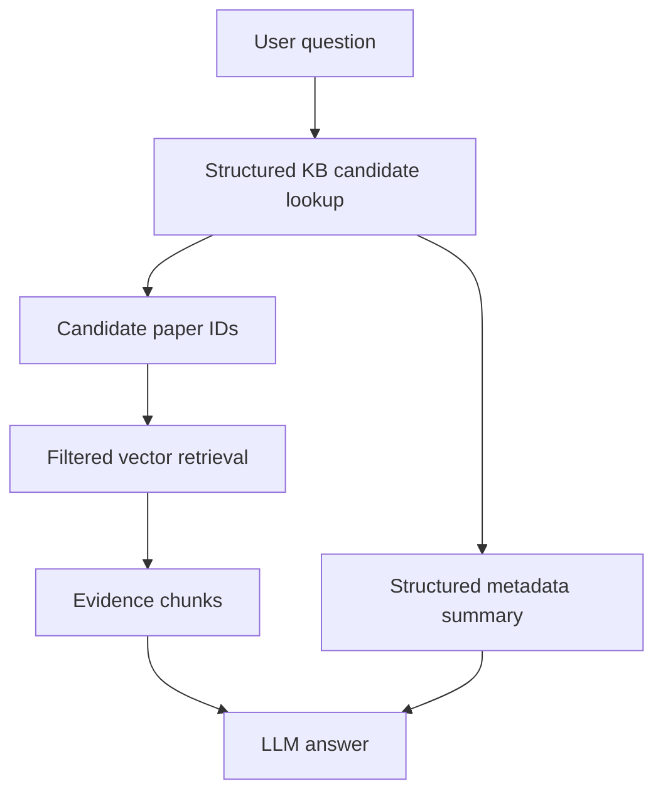

# Structured Knowledge Base

This Lv.1 optional module transforms the course knowledge assets into a structured SQLite knowledge base.

## Structure Choice

The implementation uses a hybrid structure:

- Attribute-value tables for paper metadata.
- Hierarchical topic/keyword tables from `keywords.json`.
- Entity-relation links between papers, authors, topics, keywords, and method entities.

This is suitable for single-cell/spatial omics because the assets have rich metadata, strong method entities, and clear topic labels.

## Build Flow



## Database Diagram



## Run

Build the database:

```powershell
python scripts/build_structured_kb.py
```

Run a direct query:

```powershell
python scripts/query_structured_kb.py
```

Edit `MODE` and `QUERY_TEXT` in `scripts/query_structured_kb.py`.

Supported modes:

- `method`
- `theme`
- `keyword`
- `year`
- `journal`
- `text`

Example queries:

- `MODE = "method"; QUERY_TEXT = "Nicheformer"`
- `MODE = "theme"; QUERY_TEXT = "spatial-omics"`
- `MODE = "year"; QUERY_TEXT = "2026"`
- `MODE = "journal"; QUERY_TEXT = "Nature Biotechnology"`

## Hybrid RAG Use

The structured database can also constrain RAG retrieval:

```powershell
python scripts/hybrid_rag.py
```

Hybrid flow:



This makes the structured KB collaborate with vector search: SQL handles exact metadata constraints such as year, journal, method name, topic, or keyword; vector search handles paragraph-level evidence.

The local web app exposes the same pipeline through `Hybrid 问答`. Its trace panel shows the structured candidate papers and the matched reasons, for example `year:2026`, `journal:Nature Biotechnology`, `keyword:foundation-model`, and `theme:interpretability`.

## Query Methods Covered

- Direct SQL-style lookup through `scripts/query_structured_kb.py`.
- Hybrid RAG candidate lookup through `scripts/hybrid_rag.py`.
- Browser demo through `scripts/rag_web.py` and the `Hybrid 问答` button.
